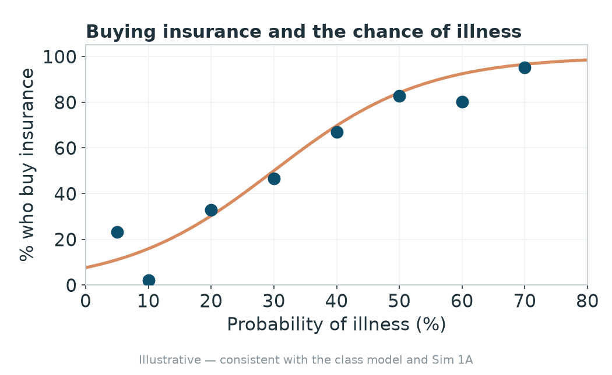
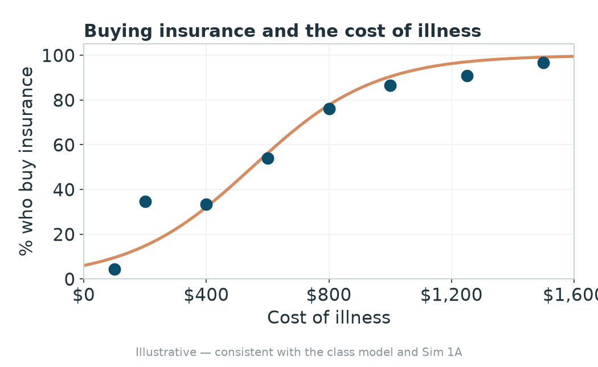
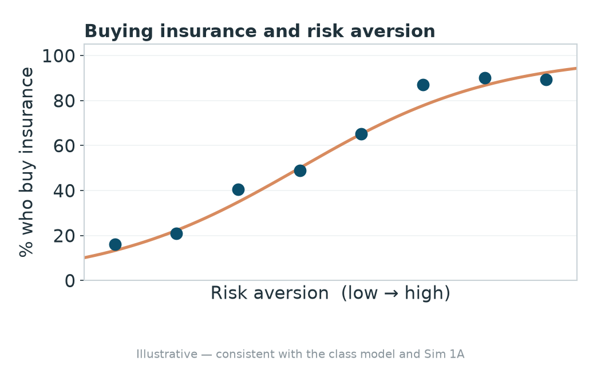

# From buyer to seller

- Two weeks ago, in the first simulation, you were the **buyer**, deciding whether a premium was worth paying.
- Today you switch sides. You are the **insurer**, and your one job is to set the premium.

# What you found as the buyer

The model from Tuesday: your willingness to pay is the **expected cost of care plus a risk premium**.

That risk premium grows with three things:

1. how **uncertain** the illness is
2. how **costly** the illness could be
3. how **risk-averse** you are

# The more likely the illness, the more you buy

{width="62%" fig-align="center"}

# The more costly the illness, the more you buy

{width="62%" fig-align="center"}

# The more risk-averse you are, the more you buy

{width="62%" fig-align="center"}

# Where the insurer lives

- People pay **more than the average cost of care** to be covered.
- That gap, between what people will pay and what care costs on average, is where an insurer can make money.
- Today, you set that price.

# Your job today

- Each round, you set **one premium**.
- Buyers pick the cheapest plan that is still worth it to them.
- Highest cumulative profit at the end wins.

# Before we start, predict

- When all of you compete for the same buyers, where do premiums end up?
- How many people end up **uninsured**?

::: {.fragment}
We put a name to what you find **next Tuesday**.
:::
